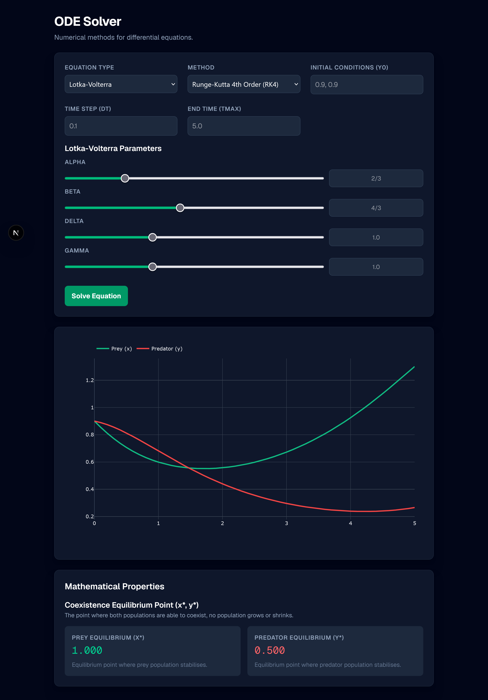

# ODE Solver

Full-stack numerical web application for solving, visualising, and analysing ordinary differential equations.



## Features

- **Numerical Methods:** Implements both Euler's Method and Runge-Kutte 4th Order (RK4) for time step calculations.
- **Pre-built Models:** Includes interactive models for Exponential Decay and the Lotka-Volterra (Predator-Prey) dynamic system.
- **Insights:** Real time calculations of the mathematical properties of the chosen model that update as parameters are adjusted.
- **Secure Maths Parser:** Safely parses and compiles user-defined mathematical strings into optimised C-code via SymPy, preventing arbitrary code execution whilst allowing complex custom equations.
- **UX:** dynamic Plotly rendering, debounced loading states, cancellation of heavy, long-running calculations over the network.

## Tech Stack

### Frontend

- Next.js / React
- Tailwind CSS
- Plotly.js

### Backend

- Python (FastAPI)
- NumPy
- SymPy

---
## Getting Started

To run this project locally, you will need to start both the Python backend and the Next.js frontend.

### 1. Backend Setup (FastAPI)
Navigate to the backend directory and set up the Python environment:

```bash
# Create and activate a virtual environment
python -m venv venv
source venv/bin/activate # on windows use venv\Scripts\activate

# Install the required numerical and API libraries
pip install fastapi uvicorn numpy sympy

# Start the server
uvicorn api:app --reload
```

The backend will now be running on `http://127.0.0.1:8000`

### 2. Frontend Setup (Next.js)

Open a new terminal window, navigate to your frontend directory, and install the dependencies:
```bash
# Install dependencies
npm install

# Start the development server
npm run dev
```

## Architecture Notes

To prevent injection attacks from the custom equation input, the backend utilises Sympy's `parse_epr` with an explicitly emptied `global_dict`. This creates a strict mathematical whitelist (e.g., `sin`, `cos`, `t`, `y`), instantly escaping if malicious system commands are detected, before compiling the safe abstract syntax tree into a vectorised NumPy function using `lambdify`.

## AI Transparency

Generative AI was used as a tool during the development of this project. The ways I used AI are:

- **Exploring ideas:** Brainstorming, planning, and refining ideas.
- **Debugging:** Assistance with debugging select issues.

All architectural decisions, security boundaries (e.g., SymPy global dictionary sandboxing and AST whitelisting), and strict typing were my own ideas and written by hand. 